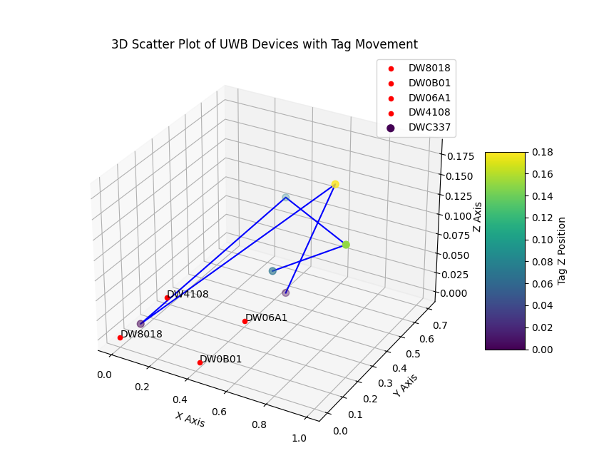

## Indoor Positioning using UWB

**Product Specification**

Product Brief: DWM1001C

Description of Change:
Decawave module DWM1001C uses the **nRF52832**-CIAA chip. A new revision of this IC has been
released by Nordic which includes fixes for certain anomalies reported in **nRF52832** Rev 1.
For more information, refer to http://infocenter.nordicsemi.com/pdf/in_105_v1.0.pdf

RF Modules DWM1001C UWB XCVR Module (FCC comp) 

Manufacturer: Qorvo

Product link: https://www.qorvo.com/products/p/DWM1001C#documents

<!--Flash software: https://www.segger.com/products/debug-probes/j-link/technology/flash-download-->

### Task 1: Setup the DWM1001C devices using node type Anchors, Tag's and Listen the information through Listener module from external PC, measure the distance and analysis the data.

##### PART 1

a) Configure the DWM1001C devices using Mobile Application ``DRTLS_Manager_R2.apk``  
b) Take **at least 6 DWM1001C devices**. Set 4 anchors, 1 tag and **1 anchors with Passive mode**.
c) Download the [Putty Software](https://www.chiark.greenend.org.uk/~sgtatham/putty/latest.html) according to your PC system configuration.  
d) Open the Putty, select the **Connection type** ``Serial`` and add the **Serial line** ``COM7`` (here UART port could be different for your PC. Go to **Device Manager > Ports**) and **Speed** ``112500 8N1`` and then click **Open**.  
e) You will see a Terminal. Click your **ENTER** button twice. Then write the command ``les`` and enter.

**Linux user:**    
c) Install minicom. ``sudo apt-get install minicom``.  
d) Then open a New Terminal type ``minicom -D /dev/ttyACM0 -b 115200``. Here ``ACM0`` number will depend on your USB/UART port. OR you can use the script using ``python3 terminal_serial_data.py``  
e) Click your **ENTER** button twice. Then write the command ``les`` and enter.  

Now you should see the distance of the **Tag device**. You can move it AROUND and analysis the distance.

##### PART 2

At this stage we can see the data, now time to visualize the data and analysis data. Here is Python Algorithm to do this job.

1. First Download the full Repository and extract it in to your PC.
2. Download the [Visual Studio Code](https://code.visualstudio.com/) Software, [Python](https://www.python.org/) and [VS Code Python extension](https://marketplace.visualstudio.com/items?itemName=ms-python.python).
2. Navigate the repository folder, you will find a file called ``3D_scatter_chart.py``. Open the file using the **Visual Studio Code** Software. Go to the Terminal option and click on a New Terminal option. Write the command  ``py -m pip install matplotlib``
3. Now Run the code.

#### Software need to be installed:

1. Embedded Studio: https://www.segger.com/downloads/embedded-studio/
2. J-Link Software and Documentation pack (Download the latest version): https://www.segger.com/downloads/jlink/
3. Arm GNU Toolchain (Download the latest version): https://developer.arm.com/downloads/-/gnu-rm
4. MobaXterm Home Edition ( **Download the Portable edition** For SSH Connection and serial port): https://mobaxterm.mobatek.net/download-home-edition.html

**Step 1:** Erase the chip and install Firmware
1. Open the SEGGER folder from your pc where you selected the path. Open the JFlashLite software and configure it. Select the **Target Device** ``NRF52832_XXAA`` **Interface** ``SWD`` and **Speed** ``1000kHz``. Then **Data File** selgo to the **Factory_Firmware_Image** and select the file ``DWM1001_PANS_R2.0.hex``  from your **local folder** (Download the folder from Onedrive). **Click** the **Erase Chip** and after completing the process click on **Program Device**. All done.